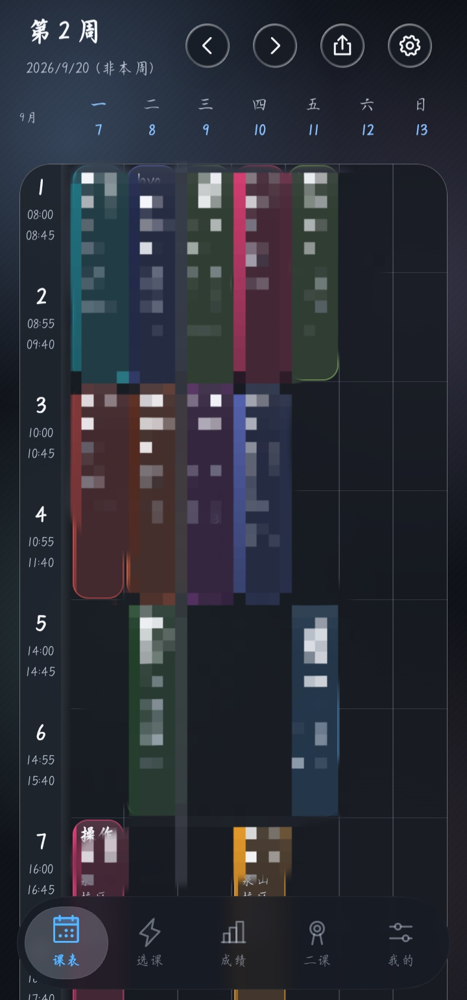
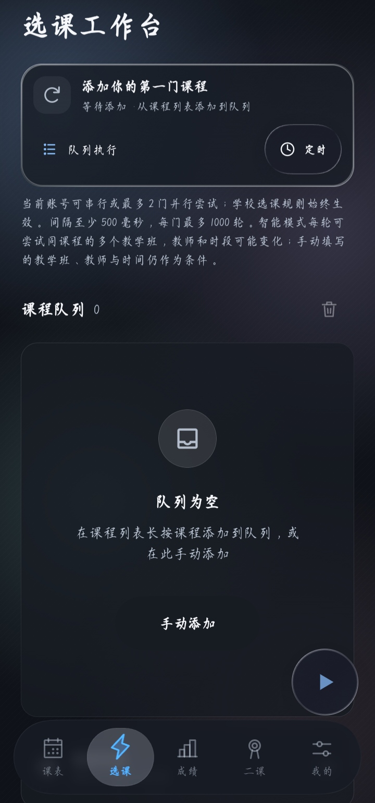
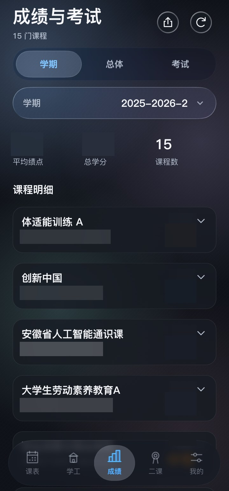
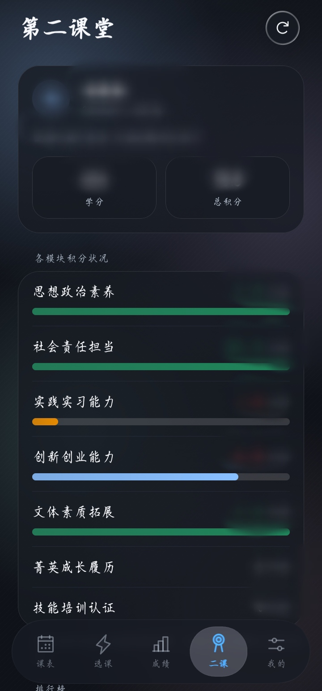
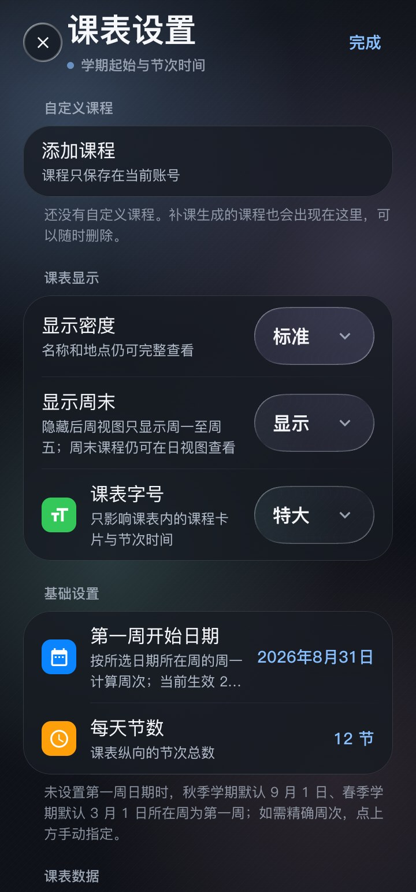
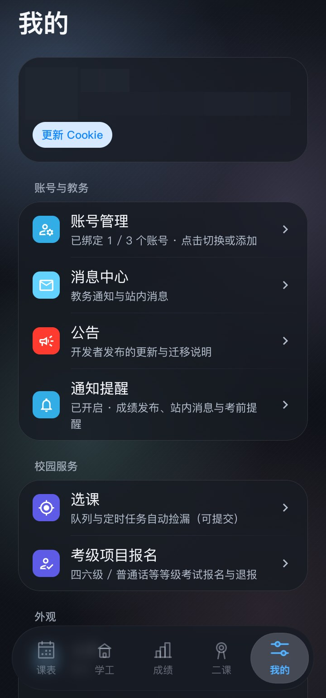

<p align="center">
  
</p>

<h1 align="center">教务助理</h1>

<p align="center">
  <strong>开源 · 免费 · 安全</strong><br/>
  Android 教务客户端，HNNU学子专用（正方教务 + 第二课堂）<br/>
  支持 Android 与鸿蒙（HarmonyOS NEXT，经卓易通兼容层）<br/>
  选课、课表、成绩、第二课堂，UI 是一整套液态玻璃
</p>

<p align="center">
  <sub>应用图标由 AI 生成；如认为该图标侵犯您的权益，请联系作者，核实后会及时删除或更换。</sub><br/>
  <sub>本应用基于原作者 <a href="https://github.com/znjhahaha/zhengfang-apk">znjhahaha / zhengfang-apk</a> 修改扩展而来，感谢原作者的慷慨开源 ❤</sub>
</p>

<p align="center">
  <a href="https://github.com/Elisoar111/hnnu-jiaowu-app/releases/latest"></a>
  <a href="https://gitee.com/Elisoar/hnnu-jiaowu-app/releases"></a>
  <a href="LICENSE"></a>
  <a href="https://github.com/Elisoar111/hnnu-jiaowu-app/stargazers"></a>
</p>

---

## 这是什么

一个给HNNU学子用的教务客户端。界面全套液态玻璃：折射、色散、高光都是实时算的，按下去会形变，松手弹回来，不是贴一层半透明白糊上去。老设备跑不动实时模糊会自动回退到透镜采样，不会直接卡死。

五个页面装下全部高频操作：**课表 · 选课 · 成绩 · 二课 · 我的**。冷启动欢迎回来，登录一次自动续期，通知直达课程详情。

---

## 界面预览

<table>
  <tr>
    <td align="center" width="33%">
      <br/>
      <sub><b>课表</b>：周视图、日期标注、当前节高亮，横滑切周</sub>
    </td>
    <td align="center" width="33%">
      <br/>
      <sub><b>选课工作台</b>：队列 / 定时 / 捡漏，圆钮一键执行</sub>
    </td>
    <td align="center" width="33%">
      <br/>
      <sub><b>成绩与考试</b>：按学期查、GPA 自动算、考试安排</sub>
    </td>
  </tr>
  <tr>
    <td align="center" width="33%">
      <br/>
      <sub><b>第二课堂</b>：各模块完成度一目了然，榜单分层查看</sub>
    </td>
    <td align="center" width="33%">
      <br/>
      <sub><b>课表设置</b>：自定义课程、开学日期、节次时间与字号</sub>
    </td>
    <td align="center" width="33%">
      <br/>
      <sub><b>我的</b>：账号管理、主题背景、消息中心与手册</sub>
    </td>
  </tr>
</table>

---

## 功能

选课：

- 按关键词搜、按类别筛，余量和教师都显示
- 即时执行 — 有空位，拼手速

选课使用前台服务，定时启动使用 AlarmManager。通知、精确闹钟权限和系统后台限制会影响运行与触发时间；学校仍决定选课窗口、名额、学分和冲突规则。

课表成绩：

- 课表周视图，课程自动配色，可导出 `.ics` 到系统日历
- 课表字号四档可调（小 / 标准 / 大 / 特大），只影响课表，其它页面不动
- 时间冲突的课，在课程详情里手动指定本节要上的那门，另一门自动让位隐藏（按节记录、按账号保存）
- 成绩按学期查，GPA 自动算，另外还有总体成绩和考试安排

第二课堂：

- 学分、总积分与各模块完成情况集中展示，未达标一眼可见
- 成绩榜单按班级 / 专业 / 院系 / 全校查询，同分共享名次

杂项：

- 登录页一键测试主站与备用入口的连通性，连不上时直接告诉你卡在哪一环（DNS / 超时 / 证书）
- 应用内置用户手册（「我的」→ 用户手册），离线可读，主题跟随应用
- 「我的」内一键检查更新（从 Gitee 获取最新版本与更新说明）
- 公告带时间线，反馈直接发作者邮箱
- 最多使用 3 个学生账号

---

## 教务系统与限制

当前源码仅接入**淮南师范学院**教务系统（正方 jwglxt V9），主站 `jwgl.hnnu.edu.cn`（HTTPS），另配 IP 直连备用入口（HTTP，仅在应用内的网络安全白名单中放开明文）。

| 项目 | 说明 |
| --- | --- |
| 登录 | 账密直登 + RSA 密码加密；统一认证或定制页面转内置网页登录 |
| 执行限制 | 选课串行或最多 2 门并行；筛选与查询以学校返回内容为准 |

验证码、选课声明、结果待确认或登录失效时需要人工处理；应用不会绕过学校限制。

---


## 快速开始

### 直接下载（推荐）

去 [Releases 页面](https://gitee.com/Elisoar/hnnu-jiaowu-app/releases) 下载最新 APK，装上就能用。Android 7.0+，建议 12 以上，玻璃效果最全。

**鸿蒙（HarmonyOS NEXT）也能用**：通过「卓易通」兼容层安装本 APK 即可运行，安装方式与普通安卓应用一致。未做专门适配，遇到问题欢迎反馈。

**iOS 暂不支持**：本应用是安卓客户端，没有 iOS 版本；iPhone 用户请直接使用学校教务网页。后续有计划会在此更新。

GitHub 仓库同步维护：<https://github.com/Elisoar111/hnnu-jiaowu-app>。

### 从源码构建

```bash
git clone https://gitee.com/Elisoar/hnnu-jiaowu-app.git
cd hnnu-jiaowu-app
./gradlew assembleDebug
```

环境要求：Android Studio Hedgehog+、JDK 17+（Gradle 8.13 实测需 JDK 21 以下跑配置阶段）、`compileSdk 37` / `targetSdk 34` / `minSdk 24`。

---

## 新手教程

### 第一步：登录

选择或添加学校，填写教务账号密码。需要验证码时可输入或刷新图片；不确定站点通不通，先点一下「测试站点连通性」，主站和备用入口各探一次，结果直接上屏。

### 第二步：换背景（可选）

「我的」→ 背景。预设、颜色、图片三个来源，选图片之后能调模糊和蒙版。

### 第三步：选课

| 模式 | 啥时候用 | 怎么操作 |
|------|----------|----------|
| 即时执行 | 现在就有空位 | 开始选课 |
| 定时任务 | 知道几点开选课 | 开始选择 |

### 第四步：看课表 / 查成绩

底栏第一个 Tab 是课表：周视图，左右横滑切周，右上角能导出 `.ics`，字号在课表设置里调。第三个 Tab 是成绩：按学期切，GPA 自动算好，考试安排也在里面。

---

## 技术栈

Kotlin + Jetpack Compose（Material 3）。玻璃渲染用 Kyant Backdrop 2.0，`blur + lens + vibrancy` 三层，按设备能力分档，低端机降级到透镜采样。动效走 Compose Animation，spring/tween 曲线全收在 `MotionTokens` 里。网络 OkHttp + Coroutines，HTML 用 Jsoup 解析。打包发布走 GitHub Actions。

---

## 致谢

本应用基于原作者 [znjhahaha](https://github.com/znjhahaha) 的开源项目 [zhengfang-apk](https://github.com/znjhahaha/zhengfang-apk) 修改与扩展而来，感谢原作者的慷慨开源。

---

## 二次开发

项目基于 **GPLv3** 开源。


## 免责声明

- 项目开源免费，仅供学习交流
- 用出任何后果自己负责
- 选课归选课，别挂一晚上把学校教务打挂
- 应用图标由 AI 生成，如涉及侵权，联系作者核实后即删

## 许可证

[GPL-3.0](LICENSE)
